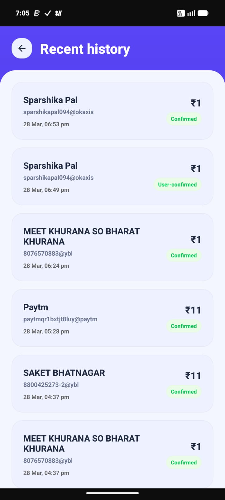
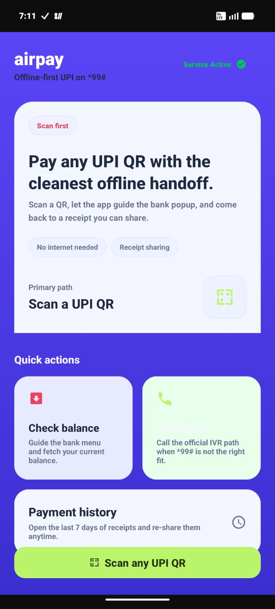

# airpay

## Team Name
team 7

## Team Members
| Name | Role | GitHub |
|------|------|--------|
| Chirag Gupta | Developer | @cgchiraggupta |
| Sparshika | Team Member | To be added |
| Meet Khurana | Team Member | To be added |

## Problem Statement
Many users face difficulty completing digital payments when connectivity is poor or unstable. airpay is focused on improving accessibility and convenience by exploring a smoother payment experience for such conditions.

## Tech Stack
- Android
- Kotlin

## Links
- **Live Demo:** https://airpaywebsite.vercel.app/about
- **Video Demo:** https://youtube.com/shorts/viAPPQx1r9U?si=aYHEXjK7b6zZsqi7
- **Presentation (PPT/PDF):** To be added

## Screenshots

## How to Run Locally
Project demo assets and additional details will be shared through the links above.

## Public Code Sample
A small UI-only code sample is included in `public-ui/` for hackathon review. It is a static frontend preview and does not expose internal application logic or private implementation details.

## Submission Notes
- This public submission contains only non-sensitive hackathon materials.
- Core source code and internal implementation details are intentionally excluded.
